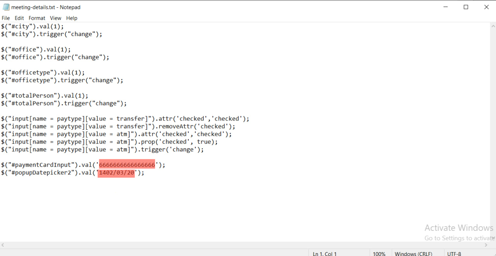
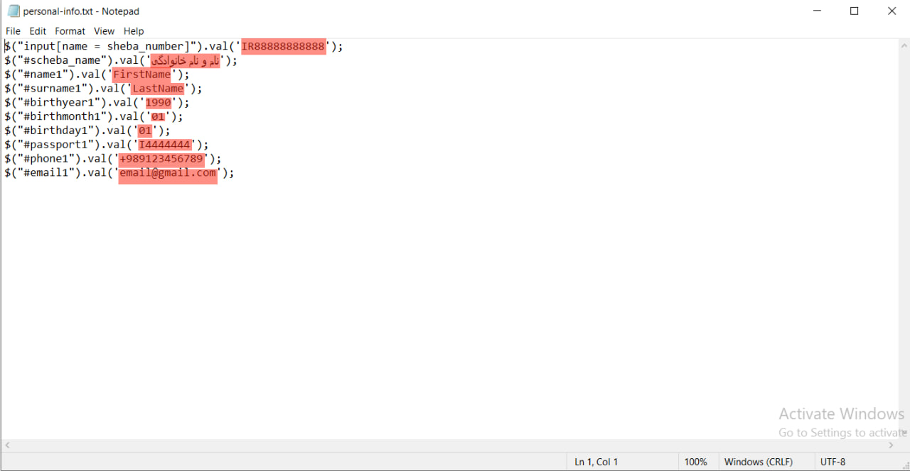
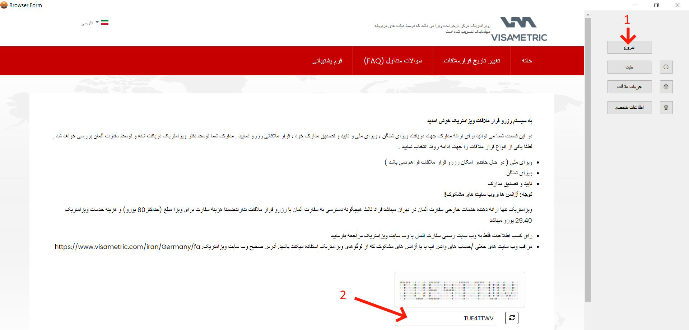
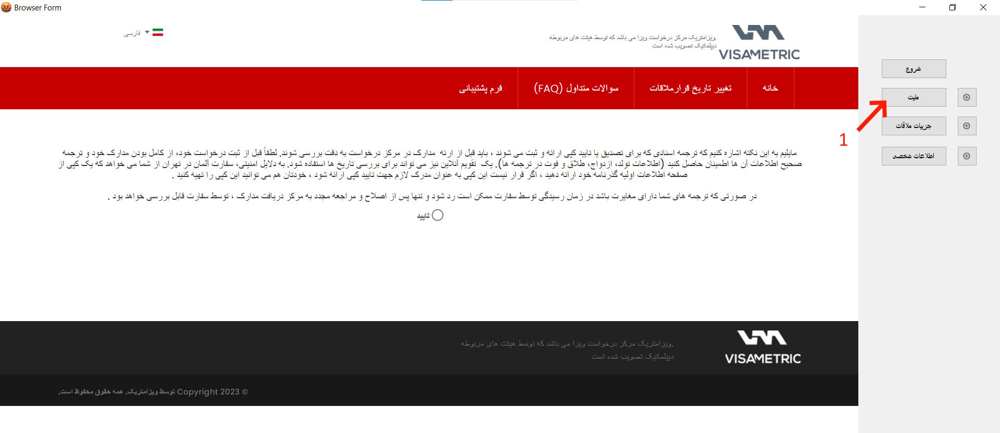
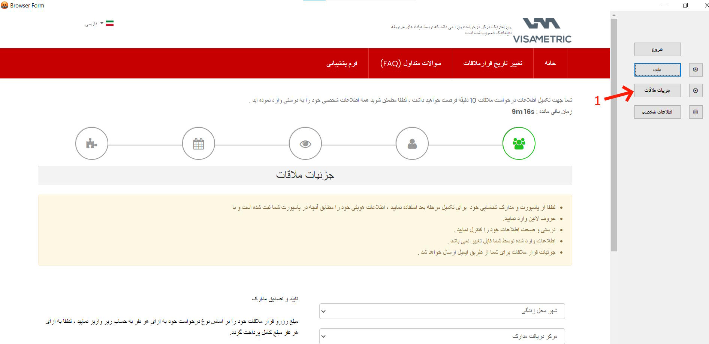
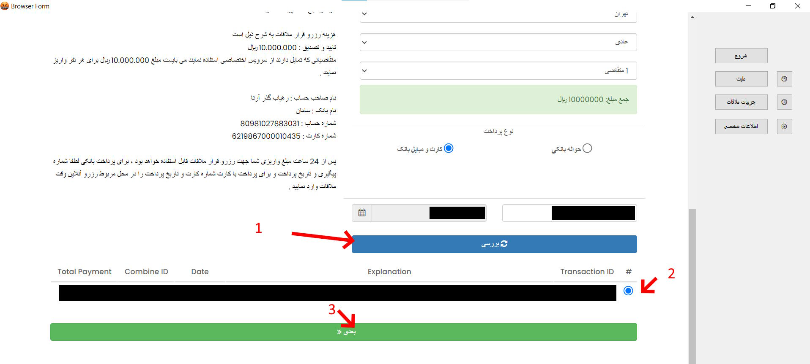
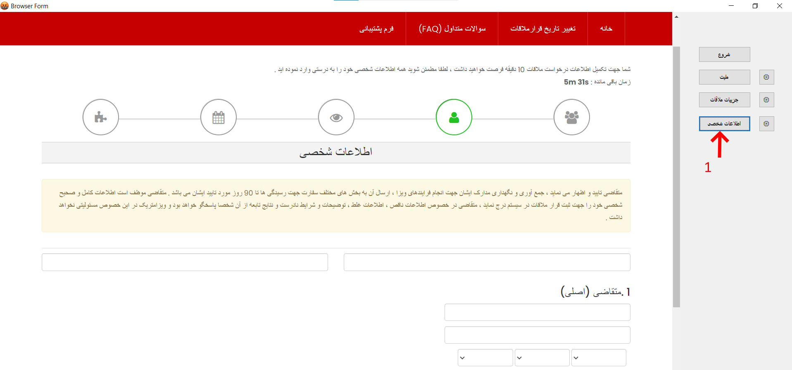

# visametric-semi-automation

## نحوه استفاده
1- فایل publish.rar را از آدرس زیر دانلود نمایید

https://github.com/myanonusername/visametric-semi-automation/releases/

2- با استفاده از دکمه های تنظیمات، اطلاعات ورودی را تکمیل نمایید

3- پس از ذخیره، با زدن دکمه شروع وب سایت بارگذاری شده و میتوانید از دکمه های دیگر در صفحه مربوطه عملیات پر کردن را انجام دهید

## پیشنهادات برای آینده

- میتوان کپچا  را با استفاده از ربات تلگرامی به گروه ارسال نمود و پاسخ را درج کرد

- می توان ایمیل را نیز به همین صورت و یا بوسیله ریدایرکت اتوماتیک پر کرد

